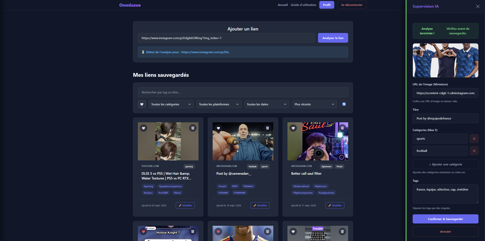
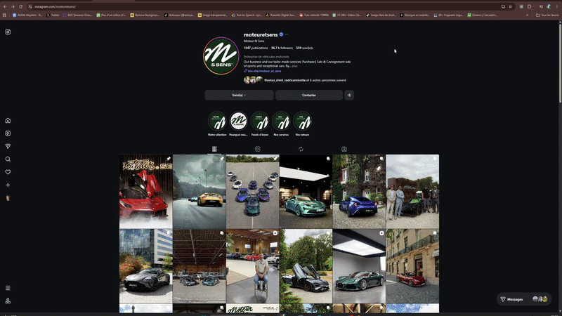

# ⚡ Omnisave

> A smart, centralized bookmarking ecosystem powered by Natural Language Processing (NLP) to automatically categorize and manage saved content from across the web.

## 📖 Overview
Omnisave solves the problem of fragmented saved links (Instagram, TikTok, YouTube Shorts, web articles) by centralizing them into a single, intelligent dashboard. Using a custom Chrome Extension, users can "Fast-Save" any webpage in one click. In the background, a Python backend extracts the content and uses a hybrid NLP engine to analyze, tag, and categorize the link before saving it to a MySQL database.

### 📸 Screenshots


*The main React dashboard featuring the AI Supervision panel (right) and the manual editing sidebar (left) to refine categorized links.*


*The Chrome Extension in action on Instagram, demonstrating 1-click Fast-Save and native OS background notifications.*

## ✨ Key Features

### 📱 Cross-Platform Saving (Desktop & Mobile)
* **Chrome Extension (PC):** Capture the active tab's URL and title instantly. The Service Worker handles API requests and AI analysis silently with native OS badge/notifications.
* **iOS Smart Share (Mobile):** A custom Apple Shortcut integrates directly into the native iOS Share Sheet, allowing users to save content straight from the Instagram, TikTok, or X apps without opening a browser.
* **Fast-Save Toggle:** Users can choose between background silent saving (Fast-Save ON) or manual tag review before saving (Fast-Save OFF).

### 🧠 AI Categorization & Extraction Engine
* **Smart Extraction:** Utilizes `yt_dlp` and `instaloader` to bypass standard scraping limits, fetching accurate titles, descriptions, authors, and thumbnails from complex platforms like X.com and Instagram.
* **Hybrid NLP Model:** Built with **SpaCy** for robust text analysis.
* **Dynamic Lexicons:** Uses a dual-JSON lexicon system:
  * *Static/Core Lexicon:* Curated baseline keywords.
  * *Community Lexicon:* Dynamically evolves based on user interactions and manual tag adjustments, allowing the engine to learn over time.

### 💻 Web Dashboard (React & PWA)
* **Interactive Onboarding:** A built-in, video-guided Swiper presentation helps new users install the extension and set up mobile shortcuts.
* **Advanced Search & Filtering:** Search by Title or Tags. Filter by Categories and timeframes (Today, This Week, This Month, etc.).
* **Detailed Editing:** A dedicated sidebar allows users to fine-tune AI results (edit title, manage tags, and assign up to 5 categories).

## 🛠️ Tech Stack

* **Frontend:** React, Vite, CSS (Custom UI), Swiper.js
* **Backend:** Python, Flask, RESTful API
* **Data Extraction:** `yt_dlp`, `instaloader`
* **AI & NLP:** SpaCy, Custom JSON Lexicon Engine
* **Database:** MySQL (managed locally via Laragon)
* **Browser Extension:** Chrome Manifest V3, JavaScript, HTML/CSS

## 🏗️ Architecture Flow

1. **Capture:** The user triggers a save via the Chrome Extension or the iOS Share Shortcut.
2. **Extraction:** The Flask backend identifies the platform via an `ExtractorFactory` and pulls the raw metadata and text.
3. **Analysis (AI):** The scraped content is fed to the SpaCy NLP engine to predict tags and categories.
4. **Save:** The backend automatically persists the processed data into the MySQL database.
5. **Manage:** The user accesses the React web dashboard (or PWA) to view, filter, and refine their saved ecosystem.

## 🚀 Installation & Local Development

### 0. Prerequisites
Ensure you have the following installed on your machine:
* **Node.js** (v18+ recommended)
* **Python** (v3.10+ recommended)
* **MySQL** (via Laragon, XAMPP, or native)

### 1. Database Setup
Ensure you have a local MySQL server running (e.g., using [Laragon](https://laragon.org/)).
Create a database named `omnisave` (or as configured in your backend environment variables).

### 2. Backend (Python/Flask)
```bash
# Navigate to the backend directory
cd backend

# Create and activate a virtual environment
python -m venv .venv
source .venv/bin/activate  # On Windows: .venv\Scripts\activate

# Install dependencies
pip install -r requirements.txt

# Start the Flask server
python app.py

# Create a .env file in the backend directory
# Required variables:
# SECRET_KEY=secret_jwt_key
```

### 3. Frontend (React/Vite)
```bash
# Navigate to the frontend directory
cd frontend

# Install dependencies
npm install

# Start the development server
npm run dev

# Note: To test the mobile PWA on your local network (e.g., from an iPhone), use:
npm run dev -- --host
```

### 4. Chrome Extension
```bash
# Navigate to the extension directory
cd omnisave-extension

# Build the extension
npm install
npm run build
```

- Open Google Chrome and go to chrome://extensions/.

- Enable Developer mode in the top right.

- Click Load unpacked and select the omnisave-extension/dist folder.

## 🗺️ Roadmap
- [ ] **API Key Authentication:** Migrate the iOS Shortcut authentication from temporary session tokens to static, user-generated API Keys for permanent stability.

- [ ] **Complete UI/UX Overhaul:** Transition the current functional MVP interface into a fully polished, modern, and responsive design system.

- [ ] **Platform-Specific Filtering:** Add dedicated filters for platforms like Instagram, YouTube, and TikTok in the web dashboard.

- [ ] **Lexicon Evolution:** Expand the community lexicon logic with automated weighting based on user corrections.

## 👨‍💻 Author
**Anthony** - *Fullstack Developer*
Developed as a comprehensive ecosystem project blending web development, API integration, and applied AI.