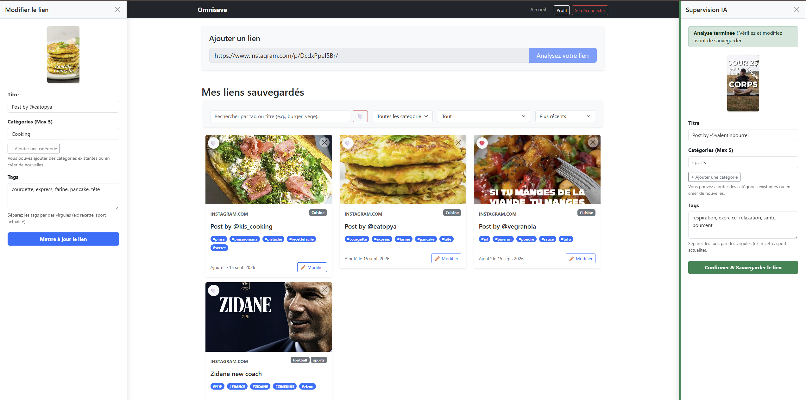
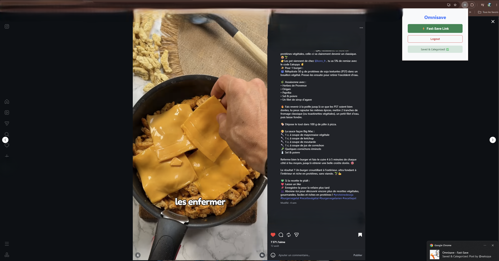

# ⚡ Omnisave

> A smart, centralized bookmarking ecosystem powered by Natural Language Processing (NLP) to automatically categorize and manage saved content from across the web.

## 📖 Overview
Omnisave solves the problem of fragmented saved links (Instagram, TikTok, YouTube Shorts, web articles) by centralizing them into a single, intelligent dashboard. Using a custom Chrome Extension, users can "Fast-Save" any webpage in one click. In the background, a Python backend extracts the content and uses a hybrid NLP engine to analyze, tag, and categorize the link before saving it to a MySQL database.

### 📸 Screenshots


*The main React dashboard featuring the AI Supervision panel (right) and the manual editing sidebar (left) to refine categorized links.*


*The Chrome Extension in action on Instagram, demonstrating 1-click Fast-Save and native OS background notifications.*

## ✨ Key Features

### 🧩 Chrome Extension (MVP)
* **One-Click Fast-Save:** Capture the active tab's URL and title instantly.
* **Background Processing:** The Service Worker handles API requests and AI analysis silently.
* **System Notifications:** Get native OS feedback (Badge/Notification) once the link is securely processed and saved, without keeping the popup open.

### 🧠 AI Categorization Engine
* **Hybrid NLP Model:** Built with **SpaCy** for robust text analysis.
* **Dynamic Lexicons:** Uses a dual-JSON lexicon system:
  * *Static/Core Lexicon:* Curated baseline keywords.
  * *Community Lexicon:* Dynamically evolves based on user interactions and manual tag adjustments, allowing the categorization engine to learn and adapt over time.

### 💻 Web Dashboard (React)
* **Advanced Search & Filtering:** Search by Title or Tags. Filter by Categories (and soon by Platform).
* **Smart Sorting:** Sort links by Oldest/Newest, Favorites, or specific timeframes (Today, This Week, This Month, Last 6 Months, > 1 Year).
* **Quick Actions:** Favorite, delete, or open links directly from the card.
* **Detailed Editing:** A dedicated left sidebar allows users to fine-tune AI results (edit title, manage tags, and assign up to 5 categories).

## 🛠️ Tech Stack

* **Frontend:** React, Vite, CSS (Custom UI)
* **Backend:** Python, Flask, RESTful API
* **AI & NLP:** SpaCy, Custom JSON Lexicon Engine
* **Database:** MySQL (managed locally via Laragon)
* **Browser Extension:** Chrome Manifest V3, JavaScript, HTML/CSS

## 🏗️ Architecture Flow

1. **Capture:** The Chrome Extension extracts the active URL and passes a JWT token for authentication.
2. **Preview (AI):** The Flask backend scrapes the content and feeds it to the SpaCy NLP engine to predict tags and categories.
3. **Save:** The backend automatically persists the processed data into the MySQL database.
4. **Manage:** The user accesses the React web dashboard to view, filter, and refine their saved ecosystem.

## 🚀 Installation & Local Development

### 1. Database Setup
Ensure you have a local MySQL server running (e.g., using [Laragon](https://laragon.org/)).
Create a database named `omnisave` (or as configured in your backend environment variables).

### 2. Backend (Python/Flask)
```bash
# Navigate to the backend directory
cd backend

# Create and activate a virtual environment
python -m venv .venv
source .venv/bin/activate  # On Windows: .venv\Scripts\activate

# Install dependencies
pip install -r requirements.txt

# Start the Flask server
python app.py
```

### 3. Frontend (React/Vite)
```bash
# Navigate to the frontend directory
cd frontend

# Install dependencies
npm install

# Start the development server
npm run dev
```

### 4. Chrome Extension
```bash
# Navigate to the extension directory
cd omnisave-extension

# Build the extension
npm install
npm run build
```

- Open Google Chrome and go to chrome://extensions/.

- Enable Developer mode in the top right.

- Click Load unpacked and select the omnisave-extension/dist folder.

## 🗺️ Roadmap
- [ ] **Complete UI/UX Overhaul:** The current iteration focuses strictly on delivering a functional V1 (MVP) with robust backend mechanics. The next major phase will introduce a fully polished, modern, and responsive user interface.
- [ ] **Platform-Specific Filtering:** Add dedicated filters for platforms like Instagram, YouTube, and TikTok in the web dashboard.
- [ ] **Native Integration:** Develop Content Scripts to inject native "Omnisave" buttons directly into social media sites (next to native share buttons).
- [ ] **Lexicon Evolution:** Expand the community lexicon logic with automated weighting based on user corrections.